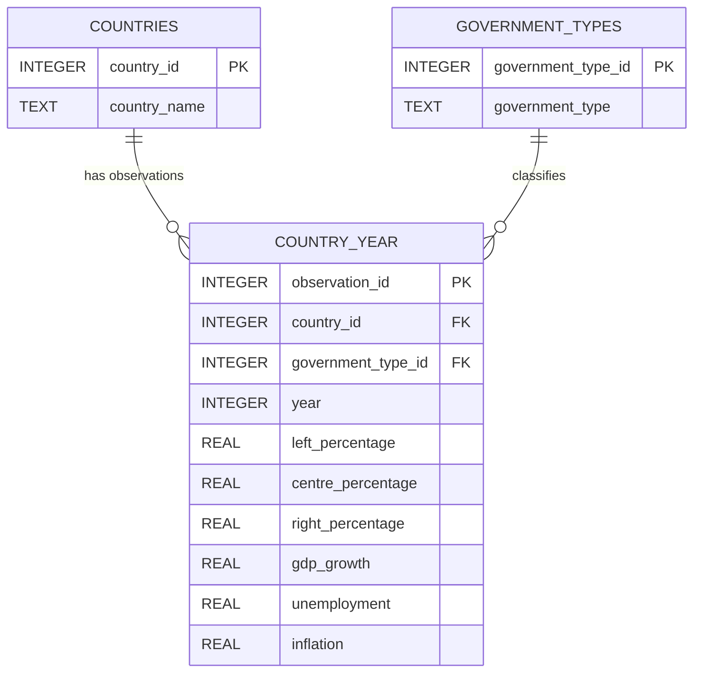

```mermaid
erDiagram

    COUNTRIES ||--o{ COUNTRY_YEAR : "has observations"
    GOVERNMENT_TYPES ||--o{ COUNTRY_YEAR : "classifies"

    COUNTRIES {
        INTEGER country_id PK
        TEXT country_name
    }

    GOVERNMENT_TYPES {
        INTEGER government_type_id PK
        TEXT government_type
    }

    COUNTRY_YEAR {
        INTEGER observation_id PK
        INTEGER country_id FK
        INTEGER government_type_id FK
        INTEGER year
        REAL left_percentage
        REAL centre_percentage
        REAL right_percentage
        REAL gdp_growth
        REAL unemployment
        REAL inflation
    }
```